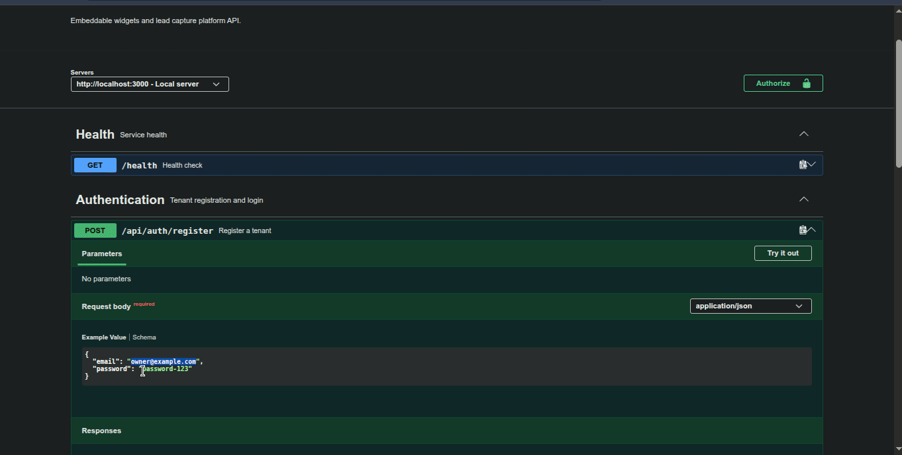

# FlyRank Capstone: Embeddable Widget & Lead-Capture Platform

Multi-tenant SaaS platform for creating lead-capture widgets and embedding them on external websites with a single `<script>` tag. The backend uses Node.js, Express and PostgreSQL, with a focus on CORS, boundary validation, tenant isolation, abuse protection and resilient external integrations.

## System Architecture

```text
[ Widget Owner ]
  |
  | JWT / Bearer
  v
+-------------------------+       +-------------------------+
| Widget Management API   | ----> | PostgreSQL Database     |
| Auth + CRUD + Dashboard |       | tenants                 |
+-------------------------+       | widgets                 |
              | submissions             |
              +-------------------------+

[ Customer Website :8080 ]
  |
  | GET /widget.js
  | GET /api/widgets/:id/config (CORS + cache)
  v
+-------------------------+
| Public Widget Delivery  |       Express API :3000
+-------------------------+
  |
  | POST /api/submissions
  | Zod + honeypot + rate limit
  | Geo fallback + safe notification
  v
    [ Lead saved in PostgreSQL ]
```

## Getting Started

### Prerequisites

- Node.js 22 or later
- npm
- Docker e Docker Compose

### Setup

```sh
npm install
cp .env.example .env
docker compose up -d
npm run dev
```

The API will be available at `http://localhost:3000`.

### Client dashboard

The React/Vite dashboard is located in [`front-end/`](front-end/). Start it in a second terminal after starting the API:

```sh
cd front-end
npm install
cp .env.example .env
npm run dev
```

Open `http://localhost:5173`. The dashboard supports tenant login/registration, widget CRUD, embed-snippet copying, lead viewing and submission statistics. `VITE_API_URL` defaults to `http://localhost:3000`.

### Dashboard demonstration



To validate a production build:

```sh
cd front-end
npm run build
```

Run the automated tests with:

```sh
npm test
```

To open the client site from a different origin:

```sh
npx serve test-site -l 8080
```

The widget ID used by the client site is in `test-site/index.html`. To create a new widget, use Postman and replace the ID with the returned value.

## Swagger / OpenAPI

Interactive documentation is available at:

`http://localhost:3000/api-docs/`

The document describes authentication, widgets, public delivery, submissions and the dashboard. The specification is defined in `src/config/swagger.js`.

## API Endpoints

### Health and documentation

- `GET /health` - checks whether the API is available.
- `GET /api-docs/` - opens the Swagger UI.

### Authentication

- `POST /api/auth/register` - registers a tenant and stores a password hash.
- `POST /api/auth/login` - returns a JWT valid for 24 hours.

### Authenticated widget management

Send `Authorization: Bearer <token>` with the following routes:

- `POST /api/widgets` - creates a widget.
- `GET /api/widgets` - lists the authenticated tenant's widgets.
- `GET /api/widgets/:id` - gets an owned widget.
- `PUT /api/widgets/:id` - updates an owned widget.
- `DELETE /api/widgets/:id` - deletes an owned widget.

Widget responses include `embed_snippet`.

### Public delivery

- `GET /widget.js` - serves the embeddable script with public caching.
- `GET /api/widgets/:id/config` - serves only the widget's public configuration.

### Public submission

- `OPTIONS /api/submissions` - handles the CORS preflight.
- `POST /api/submissions` - receives a lead, validates the payload, blocks the honeypot, applies rate limiting, attempts geolocation and saves the submission.

### Authenticated dashboard

Envie `Authorization: Bearer <token>`:

- `GET /api/widgets/:id/submissions` - lists the widget's leads, newest first.
- `GET /api/widgets/:id/stats` - returns the total count and country/city aggregates.

## Security and Resilience

- Multi-tenant isolation is enforced in widget and submission queries.
- CORS is configured to allow public widget embedding.
- JSON payloads are limited to 16 KB; invalid bodies return `4xx` errors.
- The default rate limit is five submissions per minute per IP/widget.
- The `address_line_2` honeypot blocks bots without persisting the lead.
- Geolocation tries `ip-api.com` and then `ipapi.co`.
- If both providers fail, the lead is saved with null `geo_data`.
- Mock notification failures do not change the submission success response.
- Password-like fields are rejected by the public endpoint.

## Postman

Import [postman/FlyRank-Capstone.postman_collection.json](postman/FlyRank-Capstone.postman_collection.json). Run `Register tenant`, `Login tenant` and `Create signup widget`; the `token` and `widgetId` variables are filled automatically. The collection also includes delivery, submissions, dashboard, validation, honeypot, oversized-payload and Swagger requests.

## Database and Configuration

PostgreSQL runs through Docker Compose on port `5432`. On a fresh volume, `src/database/init.sql` creates `tenants`, `widgets`, `submissions`, foreign keys and indexes.

Copy `.env.example` to `.env`. The `.env` file is ignored by Git and must never be committed. The application connects exclusively through `DATABASE_URL`.

## Evidence and Build History

- [EVIDENCE.md](EVIDENCE.md) records test and probe results.
- [BUILDLOG.md](BUILDLOG.md) records AI assistance, discovered failures and fixes.
- [capstone.yaml](capstone.yaml) contains run, test, seed and base URL commands.

## Known Limitations

- Notification delivery is mocked with `console.log`; no real email or webhook provider is configured.
- The geolocation providers are free public services and may time out or apply rate limits.
- The rate limiter uses local memory and should be replaced with a shared store for multiple instances.
- The client site uses different local ports (`8080` and `3000`) to simulate cross-origin traffic; no external CDN is used in this environment.
